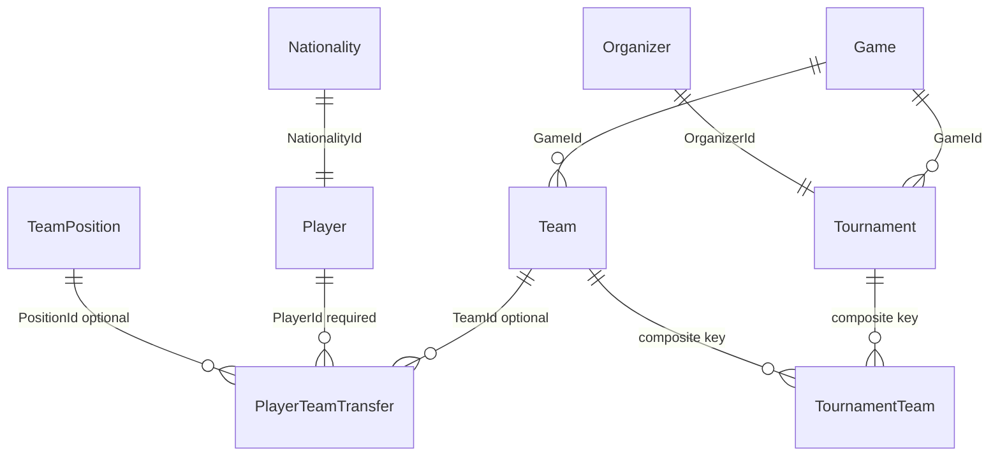

# MongoDB coursework (Balkana data)

This folder implements the university coursework design: five MongoDB collections mirroring SQL tables **Teams**, **Players**, **PlayerTeamTransfers**, **Tournaments**, and **TournamentTeams**, plus optional SQL export scripts and indexes.

## Relational model (source: EF Core / SQL Server)



| SQL table | Primary key | Notes |
|-----------|-------------|--------|
| Teams | `Id` | FK `GameId`, optional `BrandId` |
| Players | `Id` | FK `NationalityId` |
| PlayerTeamTransfers | `Id` | FK `PlayerId`; nullable `TeamId`; `Status` enum |
| Tournaments | `Id` | FK `OrganizerId`, `GameId`; config fields as JSON strings |
| TournamentTeams | `(TournamentId, TeamId)` | M:N with attribute `Seed` |

## MongoDB collections (recommended shape)

| Collection | `_id` | Fields |
|------------|-------|--------|
| `teams` | SQL `Id` (int) | `tag`, `fullName`, `yearFounded`, `logoURL`, `gameId`, optional `brandId` |
| `players` | SQL `Id` (int) | `nickname`, optional `firstName`/`lastName`, `nationalityId`, optional `birthDate`, `prizePoolWon` (Decimal128) |
| `playerTeamTransfers` | SQL `Id` (int) | `playerId`, optional `teamId`, `startDate`, optional `endDate`, `status` (string), optional `positionId` |
| `tournaments` | SQL `Id` (int) | `fullName`, `shortName`, `organizerId`, `description`, dates, `prizePool`, `pointsConfiguration`, `prizeConfiguration`, `bannerUrl`, `elimination`, `gameId`, `isPublic` |
| `tournamentTeams` | New `ObjectId` | `tournamentId`, `teamId`, `seed` — **unique** on `(tournamentId, teamId)` |

### Referencing vs embedding

- **TournamentTeams** stays a **separate collection** (not embedded in `tournaments`) because it is a many-to-many link with its own attribute (`seed`), matching the SQL composite key and keeping tournament documents smaller.
- **PlayerTeamTransfers** are **separate documents** so roster history stays normalized and easy to filter by `playerId` or `teamId`, like the SQL join table.

Optional extra collections for lookups: run [SqlExport/Games.sql](SqlExport/Games.sql), [Organizers.sql](SqlExport/Organizers.sql), [Nationalities.sql](SqlExport/Nationalities.sql) if you want human-readable joins without denormalization.

## Import path A — C# ETL (recommended)

Uses the same EF model as the website, so types and nullability match SQL.

1. Set **SQL Server** connection (same as Balkana) and **MongoDB** URI in [appsettings.json](appsettings.json), or via environment variables:
   - `ConnectionStrings__DefaultConnection`
   - `MongoCoursework__ConnectionString` or `MONGO_COURSEWORK_CONNECTION_STRING`
   - Optional: `MongoCoursework__DatabaseName` (default `balkana_coursework`)

2. From the repository root:

   ```bash
   dotnet run --project tools/Balkana.MongoCoursework/Balkana.MongoCoursework.csproj
   ```

3. By default the tool **clears** the five collections then inserts and **creates indexes**. To append without deleting first (may duplicate or hit unique index errors):

   ```bash
   dotnet run --project tools/Balkana.MongoCoursework/Balkana.MongoCoursework.csproj -- --no-clear
   ```

4. The tool prints document counts next to SQL row counts for a quick validation.

## Import path B — SQL `FOR JSON` + mongoimport

Scripts live under [SqlExport/](SqlExport/). In SSMS, run each query, save the JSON result, then adapt for `mongoimport`:

- SQL `FOR JSON` wraps rows in a root array and uses **PascalCase** property names; Mongo documents from this repo’s ETL use **camelCase** and `_id`. For coursework you can either document that difference or transform with `jq` before import.
- `TournamentTeams` rows need an `_id` if you want ObjectIds (`mongoimport` can omit and let Mongo generate them only if you import as extended JSON with `$oid`, or use a pipeline).

For tournament teams, importing the ETL’s shape is much simpler than hand-converting JSON from SQL.

## Indexes

The ETL creates:

- `teams`: `{ gameId: 1 }`
- `players`: `{ nationalityId: 1 }`
- `playerTeamTransfers`: `{ playerId: 1 }`, `{ teamId: 1 }`
- `tournaments`: `{ gameId: 1 }`, `{ organizerId: 1 }`
- `tournamentTeams`: unique `{ tournamentId: 1, teamId: 1 }`, plus `{ teamId: 1 }`

To apply the same indexes manually:

```bash
mongosh "mongodb://127.0.0.1:27017/balkana_coursework" tools/Balkana.MongoCoursework/scripts/init-indexes.mongosh.js
```

## Optional improvement

`PointsConfiguration` and `PrizeConfiguration` are stored as **strings** in SQL (JSON text). In Mongo you could parse them into BSON objects during ETL for richer queries; the current tool copies them as strings for a faithful export.

## Docker / VPS note

Run the ETL where it can reach both servers (e.g. on the VPS, or from a container on the same Docker network as SQL and Mongo). Use hostnames your Balkana container already uses for SQL, not necessarily `localhost` from inside another container.
