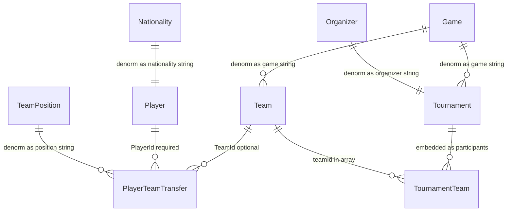

# MongoDB export (Balkana, denormalized)

The ETL tool copies SQL Server data into MongoDB database **`balkana`** (default) using **four collections**: `teams`, `players`, `playerTeamTransfers`, `tournaments`. Lookup values are **denormalized** into readable strings; `TournamentTeams` rows are embedded as **`participants`** on each tournament document.

## Relational source (EF Core / SQL Server)



| SQL | In Mongo |
|-----|----------|
| `Teams` | `teams` — `game` = `Games.FullName` (no `gameId`) |
| `Players` | `players` — `nationality` = `Nationalities.Name` (no `nationalityId`) |
| `PlayerTeamTransfers` | `playerTeamTransfers` — optional `position` = `TeamPositions.Name` (no `positionId`) |
| `Tournaments` | `tournaments` — `game`, `organizer` (`Organizers.FullName`), `participants: [{ seed, teamId }, ...]` |
| `TournamentTeams` | Embedded only (not a collection) |

Missing FK targets resolve to the string **`Unknown`**.

## Document shapes (camelCase)

- **teams**: `_id`, `tag`, `fullName`, `yearFounded`, `logoURL`, `game`, optional `brandId`
- **players**: `_id`, `nickname`, `nationality`, `prizePoolWon`, optional `firstName`, `lastName`, `birthDate`
- **playerTeamTransfers**: `_id`, `playerId`, optional `teamId`, `startDate`, optional `endDate`, `status`, optional `position`
- **tournaments**: `_id`, `fullName`, `shortName`, `organizer`, `description`, `startDate`, `endDate`, `prizePool`, `pointsConfiguration`, `prizeConfiguration`, `bannerUrl`, `elimination`, `game`, `isPublic`, `participants`

### Example: tournament participants + team names (`$lookup`)

```javascript
db.tournaments.aggregate([
  { $match: { _id: 1 } },
  { $unwind: "$participants" },
  {
    $lookup: {
      from: "teams",
      localField: "participants.teamId",
      foreignField: "_id",
      as: "team"
    }
  },
  { $unwind: "$team" },
  {
    $project: {
      _id: 0,
      seed: "$participants.seed",
      teamTag: "$team.tag",
      teamName: "$team.fullName"
    }
  },
  { $sort: { seed: 1 } }
])
```

## Import — C# ETL (recommended)

1. Configure [appsettings.json](appsettings.json) or environment variables:
   - `ConnectionStrings__DefaultConnection` (SQL Server)
   - `MongoCoursework__ConnectionString` or `MONGO_COURSEWORK_CONNECTION_STRING`
   - Optional: `MongoCoursework__DatabaseName` (default **`balkana`**)

2. Run from repo root:

   ```bash
   dotnet run --project tools/Balkana.MongoCoursework/Balkana.MongoCoursework.csproj
   ```

3. Default behavior: **clears** the four collections (and any legacy `tournamentTeams` collection), inserts, creates indexes. Append mode:

   ```bash
   dotnet run --project tools/Balkana.MongoCoursework/Balkana.MongoCoursework.csproj -- --no-clear
   ```

## Indexes (created by ETL)

- `teams`: `{ game: 1 }`
- `players`: `{ nationality: 1 }`
- `playerTeamTransfers`: `{ playerId: 1 }`, `{ teamId: 1 }`
- `tournaments`: `{ game: 1 }`, `{ organizer: 1 }`, `{ "participants.teamId": 1 }` (multikey)

Manual apply:

```bash
mongosh "mongodb://127.0.0.1:27017/balkana" tools/Balkana.MongoCoursework/scripts/init-indexes.mongosh.js
```

## SQL `FOR JSON` scripts

[SqlExport/](SqlExport/) still targets raw SQL tables (with IDs). If you use `mongoimport` from those files, you must transform to match this denormalized shape yourself; the C# ETL is the source of truth for the **`balkana`** layout.

## Docker / VPS

Set `MongoCoursework__DatabaseName=balkana` on the `mongo-sync` service if you override the default. Run the ETL where it can reach SQL Server and MongoDB on your compose network.
